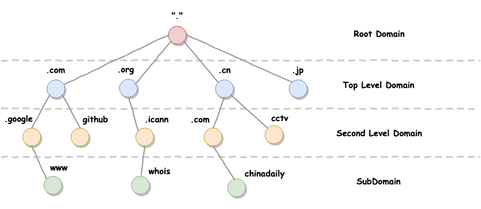
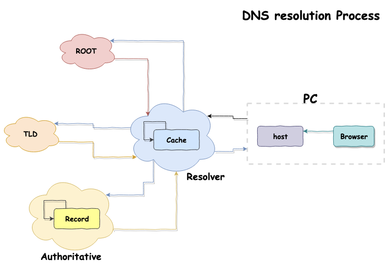

在浩瀚的网络世界中是以 `IP（Internet Protocol）` 地址来标识每台设备的网络位置的。当你使用各种聊天工具给家人和朋友发送信息时，计算机是通过对方的 IP 地址定位到对方的网络位置，从而将信息发送给对方。但是当我们直接与其他服务器通信时，例如我们访问 github 网站时，根本不需要知道 github 服务器的 IP 地址，我们只需要知道 github 的域名就可以与它通信了。这是为什么呢？因为人的记忆力十分有限，人们难以记忆毫无意义的数字，相反更容易记忆有特定含义的字符串。试想如果每次与服务器通信都需要知道对方的 IP 地址，这将是多么困难的一件事。为了解决人脑记忆力差的难题，为了拥有更好的网络体验，1983 年 Paul 发明了 DNS。

# What is DNS？

DNS 全称 **Domain Name System**，中文名叫作**域名解析系统**。它是主要作用是将域名与 IP 一一对应起来，在用户访问服务器时，将域名转换为 IP。可以使用户更方便的通过域名访问服务器，而无需记忆服务器的 IP 地址。

# Domain Name

在了解 DNS 工作原理之前，先来了解一下与之紧密相关的域名。域名就是与 IP 对应的有意义的字符串，按照人类的思维习惯域名被设计成金字塔形的多层级结构。

如上图所示，`.(ROOT)`表示根域名, 实际上每个域名尾部都含有一个`.`,这个点就表示根域名。只不过根域名对所有域名来说都是一样的,所以在平时使用的时候，就将它忽略了。在根域名的下一层级是称之为 `TLD（Top-Level-Domain）` 的顶级域名，顶级域名由 [ICANN](https://www.icann.org/) 这个组织控制。ICANN 规定了哪些字符可以被用于顶级域名。例如一般性质的 `.com`、 `.org` 域名和领域性质的 `.cn`、 `.jp` 等。截止 2019 年 7 月，TLP 的数量为 1530，可以参考这份 [List of Top-Level Domains](https://www.icann.org/resources/pages/tlds-2012-02-25-en)。

在顶级域名的下一层是 `SLD（Second-Level-Domain）` 次级域名。比如`github.com`中的 `github`。这一层级的域名不受 ICANN 控制。用户可以自己从域名提供商处注册。在次级域名的下一层还有子域（SubDomain）名,用户可以为服务器自由分配子域名。

并且域名对大小写不敏感, `github.com` 与 `GITHUB.COM` 表示的是同一个域名。

# DNS Record Types

IP 与 域名 是通过 DNS 记录关联起来的。 常用的 DNS 记录有如下几类：

- `A`： 地址记录（Address），表示域名指向的 IP 地址。
- `CNAME`：规范名称记录（Canonical Name）, 表示另一个域名。
- `MX`: 邮件记录（Mail eXchange），表示接收电子邮件的服务器地址。
- `TXT`: 文本记录 (Descriptive text)，记录一些特殊的文字信息。（一般用来做域名验证）
- `NS`： 域名服务器记录（Name Server），返回保存下一级域名信息的服务器地址。该记录只能设置为域名，不能设置为 IP 地址。

FYI: [DNS Record types](https://simpledns.com/help/dns-record-types)

# How DNS works?

DNS 到底是如何将 Domain Name 解析成为 IP 地址的呢？我们以解析 `www.wangfan.site` 为例，当我们在浏览器的地址栏中输入 `www.wangfan.site` 时，浏览器会调用操作系统级的 API 去查询该域名对应的 IP 地址。在操作系统接收到请求后：

1. 操作系统首先查找本机的 DNS 配置信息，也就是我们常说的 host 文件。如果在 host 文件中发现了对应的配置信息，则解析成功，此次查询结束。
2. 如果 host 中没有配置对应的 IP 地址，那么操作系统就会将查询操作转发到 Resolver Server（域名解析服务器）。域名解析服务器的 IP 地址有可能是本机提前配置好的，例如 Google 的`8.8.8.8`或者 CloudFlare 的 `1.1.1.1`。也有可能是根据 [DHCP 机制](https://zh.wikipedia.org/wiki/%E5%8A%A8%E6%80%81%E4%B8%BB%E6%9C%BA%E8%AE%BE%E7%BD%AE%E5%8D%8F%E8%AE%AE) 动态分配的 ISP（Internet Service Provider）的 IP 地址。
3. Resolver Server 接受到请求之后，首先从服务器的缓存中查找对应的 IP 地址。如果有查到了对应域名的 IP 地址，则将结果返回给操作系统，解析结束。
4. 若 Resolver Server 中没有对应的缓存，Resolver Server 首先在缓存中查找与域名直接相关的 Authoritative Name Server（权威命名服务器）的 IP 地址。如果找到了对应权威服务器的地址，则将向权威命名服务器发送查询请求。
5. 若 Resolver Server 的缓存中没有原始域名对应的权威服务器的地址，则 Resolve Server 会根据 DNS 协议（分级查询），在缓存中查找原始域名的上一级域名`.site`的权威服务器，也叫做 TLD Name Server（顶级域名服务器）。如果找到了对应权威服务器的地址，则将向权威命名服务器发送查询请求。
6. 如果 Resolver Server 的缓存中既没有原始域名的权威服务器地址，也没有顶级域名服务器地址。那么 Resolver Server 会直接向 Root Server 根域名服务器发送查询请求。 Root Server 的数量受限于 IP 协议包大小的限制，目前全世界只有 13 台根域名服务器。因为根域名服务器数量少，且服务器的 IP 地址一般不会变动。所以在 Resolver Server 中内置有全部的根域名服务器的 IP。
7. Root Server 接受到请求之后，会返回与原始域名对应的 TLD NS（顶级域名解析服务器）的地址。Resolver Server 根据 Root Server 返回的地址，重新向 TLD NS 发起查询请求。
8. TLD NS 接受到请求之后，返回与原始域名对应的权威服务器的地址。Resolver Server 根据 TLD NS 返回的权威服务器的地址，继续向权威服务器发起查询请求。权威服务器根据自身的 DNS Record 返回域名对应的 IP 地址。
9. Resolver Server 在获取到权威服务器返回的地址后，将原始域名对应的 IP 地址返回给操作系统。然后将原始域名对应的 IP 地址、原始域名权威服务器地址、顶级域名服务器地址全部存入自身的缓存中，以备下次查询之用。

# TTL

在配置 DNS 记录时，还有一个很重要的选项就是 TTL，TTL (Time To Live) 表示 DNS 缓存的最大时限，如果缓存时间超出了最大时限，那么 DNS Server 就会删除这条记录。等到下次需要查询 IP 时，就再走一遍复杂的查询流程。

# DNS hijacking

DNS 劫持是指攻击者通过篡改 DNS 服务器的记录，导致用户请求 IP 时，请求到了错误的 IP。从而被带入到错误的网站中。

参考资料：

1. [Domain Name Resolution Process](https://www.supportsages.com/domain-name-resolution-process/)
2. [Why There Are Only 13 DNS Root Name Servers](https://www.lifewire.com/dns-root-name-servers-3971336)
3. [https://zh.wikipedia.org/wiki/域名系统](https://zh.wikipedia.org/wiki/%E5%9F%9F%E5%90%8D%E7%B3%BB%E7%BB%9F)
4. [DNS 原理入门](http://www.ruanyifeng.com/blog/2016/06/dns.html)
5. [根域名的知识](http://www.ruanyifeng.com/blog/2018/05/root-domain.html)
