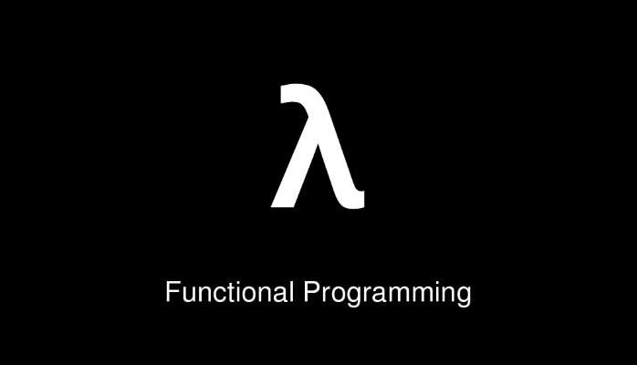
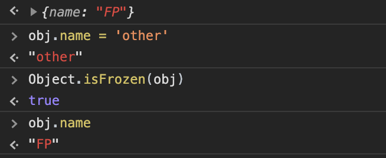
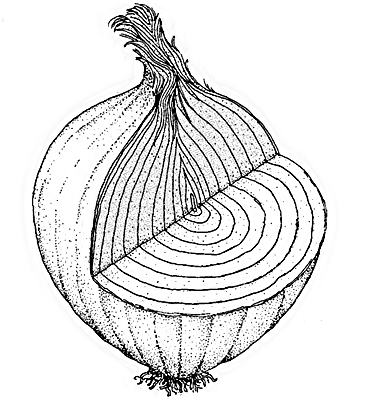
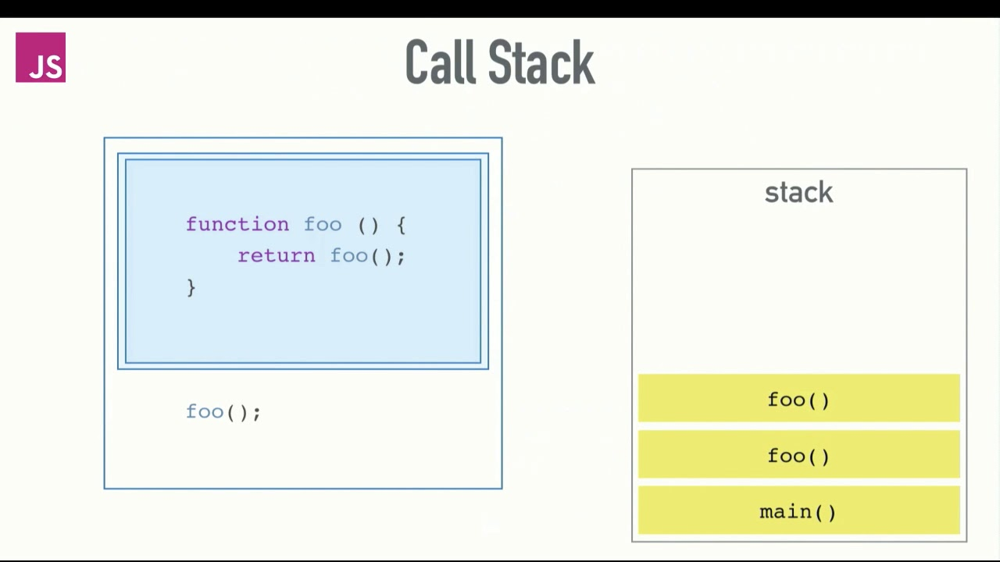

# What is it and why use it？

函数式编程是一种通过应用与组合函数来构造程序的编程范式。

函数式的特点：**声明式**、以函数使用为主, 提倡使用纯函数、消除副作用和减少状态修改。

**函数式编程思维关心数据的映射，命令式(imperative)编程关心解决问题的步骤。**

以镜像翻转二叉树的代码为例：

```javascript
// 以下代码描述了翻转二叉树的过程
function invertTree(node) {
  if (node == null) return null

  node.left = invertTree(node.right)
  node.right = invertTree(node.left)

  return node
}
```

```typescript
// 以下代码体现了如何从旧树得到一颗新树
const invertTree = (node) => {
  return node == null
    ? null
    : new Tree(node.value, invertTree(node.right), invertTree(node.left))
}
```

下面的代码体现的是如何从一颗旧树得到一颗新树，目的性非常明确（我要一棵树）。而上面的代码表示的是翻转树的过程，通过描述「从旧树得到新树应该怎样做」来达到目的。

指令式的代码更适合机器运行，因为在编写一条条的指令时很容易失焦，忘记了真正的目的。而声明式的代码更抽象、更适合人类阅读。

|     | 优势                                   | 缺陷                 |
| :-- | :------------------------------------- | :------------------- |
| 1   | 声明式编程，不拘泥于细节，代码更清晰   | 较难学习与上手       |
| 2   | 纯函数职责更小，利于测试与维护         | 需要更高层的抽象思维 |
| 3   | 鼓励复杂任务的分解，代码可重用程度变高 |                      |

## Purity

**纯函数**：函数的输出仅由输入决定，不会造成超出其副作用的变化。有助于提高代码的可测试性和可维护性。

```typescript
const greet = (name) => `Hi, ${name}`

greet('Brianne') // 'Hi, Brianne'
```

```typescript
window.name = 'Brianne'

const greet = () => `Hi, ${window.name}`

greet() // "Hi, Brianne"
```

```typescript
let greeting

const greet = (name) => {
  greeting = `Hi, ${name}`
}

greet('Brianne')
greeting // "Hi, Brianne"
```

```typescript
Date.now() // ?
Math.random() // ?
```

与当前函数作用域外产生交互的代码都是有作用的，都不是纯函数。

### Referential Transparency

```typescript
multiply(sum(1, 2),sum(1, 3)) // -> 12

// 函数的调用可以直接被返回值替换

multiply(3, 4)) // -> 12

```

## HOF❗️❗️❗️

JS 中函数是一等公民，可以像其他的变量一样被传递。

```typescript
map / filter / reduce

map(v -> v)
filter(v -> !v)

[1].map(1) = [2]
[1].map(() => 2) [3]
```

这使得函数有了 IoC(Inversion of control) 的能力。

## Immutable data

纯函数会使代码更容易维护，但是却没有“纯对象”这种东西，程序中的状态是一直可变的。为了让状态更容易管理，函数式编程推荐使用不可变数据。

```typescript
// number / string / boolean 都是不可变数据
let str = 'functional programming'
// 返回新的状态，而不是对旧状态的修改
str = 'declarative programming'

let arr = [1]

arr[2] = ''
```

1. Object.freeze - 只是浅冻结, 更深层的冻结需要递归查找耗损性能

   

2. CoW - 不断复制造成性能损耗

   [Copy-on-write](https://en.wikipedia.org/wiki/Copy-on-write)

   Lenses

   ```typescript
   interface Lens<S, A> {
     get(s: S): A
     set(a: A, s: S): S
   }

   const address: Lens<Address, Street> = {
     get: (address) => address.street,
     set: (street, address) => ({ ...address, street }),
   }

   address.get(a1)
   // => {num: 23, name: "high street"}
   address.set({ num: 23, name: 'main street' }, a1)
   // => {city: "london", street: {num: 23, name: "main street"}}
   ```

   [Introduction to optics: lenses and prisms](https://medium.com/@gcanti/introduction-to-optics-lenses-and-prisms-3230e73bfcfe)

3. Structure Sharing

   

   [Persistent data structure](https://en.wikipedia.org/wiki/Persistent_data_structure)

   JavaScript 中支持 Structure Sharing 的工具：

   [immerjs/immer](https://github.com/immerjs/immer)

   [Immutable.js](https://immutable-js.github.io/immutable-js/)

# Currying

currying 的概念很简单：对于多形参的函数，调用时只传递给它一部分参数，让它返回一个函数去处理剩下的参数。

柯里化极大程度的提高了代码的可复用性。

```typescript
const add = function (x) {
  return function (y) {
    return x + y
  }
}

add = (x, y) => x + y

var increment = add(1)
var addTen = add(10)

increment(2)
// 3

addTen(2)
// 12
```

# Combinators

上面的都是在讲如何“拆函数”，函数式编程将函数视为积木，通过函数组合子可以将独立的函数以不同的方式组合起来。

compose（Redux / Chain of Responsibility）

```typescript
compose(fc, fb, fa)('arg') = fc(fb(fa('arg')))
```

pipe

```typescript
pipe(fa, fb, fc) = fc(fb(fa('arg')))
```

tap

```typescript
// tap :: (x -> *) -> x -> x
tap((x) => {
  /* do anything */
})(x) === x
```

seq

```typescript
seq(fa, fb, fc)(x) === x
```

alt

```typescript
alt(returnFalse, returnOther)(x)

{
  const returnValue = returnFalse(x)

  return returnValue || returnOther(x)
}
```

forkJoin

```typescript
fork(last, f1, f2)(x)

{
  const r1 = f1(x),
    r2 = f2(x)

  return last(r1, r2)
}
```

## Side-effect

副作用带来的问题是不可预见的。所以在写函数式的代码时，要有意区分纯的与不纯的代码。

[https://inews.gtimg.com/newsapp_bt/0/10524648136/1000](https://inews.gtimg.com/newsapp_bt/0/10524648136/1000)

[https://img3.doubanio.com/view/photo/l/public/p2589766490.webp](https://img3.doubanio.com/view/photo/l/public/p2589766490.webp)

[计算机科学中的最严重错误，造成十亿美元损失](https://www.techug.com/post/serious-loss.html)

null 是一个价值数十亿美金的错误


Error / Exception

缺点：

1. 难以与其他函数组合与链接
2. 会引起副作用
3. 不能只关注函数的返回值，还需要负责异常的处理
4. 多个异常时会出现嵌套的 try ... catch..

把 副作用 关起来

[https://img1.doubanio.com/view/photo/l/public/p2589766489.webp](https://img1.doubanio.com/view/photo/l/public/p2589766489.webp)

### 容器


### Functor → 对操作容器内数据行为的抽象


1. Functor 必须是无副作用的

   ```typescript
   new Functor('x').map((v) => v) // -> Functor('x')
   ```

2. 必须可以与其他函数组合

   ```typescript
   new Functor(2).map(pipe(plus3, tap(log))) // -> Functor('5')
   ```

JS 中 Array 就是一个 Functor。



### Monad

> Monad 是自函子范畴上的的一个幺半群。🤦‍♀️🤦‍♂️🤦 （这是人话？


Monad 是一个抽象接口，代表具有一定规则的容器。Monad 是可以变扁（flatten）的 pointed functor。

1. of 函数，可以将值存入容器中
2. map 函数，与容器内的值交互
3. join（flatten），将嵌套的容器拍扁
4. chain，组合了 map 与 join

Promise 是不是一个 Monad ？ Array 是不是一个 Monad ？


# 优化

> 为什么“函数式编程都是垃圾”？

## 使用函数组合子避免不必要的计算

```typescript
const showStudent = pipe(
  alt(findStudent, createNewStudent),
  append('#student-info')
)
```

## 🤷‍♂️🤷‍♂️🤷‍♂️ shortcut fusion 针对于函数式链的优化

```typescript
const _ = require('lodash')
const { compose, tap } = require('ramda')

const square = compose(
  (x) => Math.pow(x, 2),
  tap((a) => console.log('square', a))
)

const isEven = compose(
  tap(() => console.log('even')),
  (x) => x % 2 === 0
)

const numbers = _.range(200)
console.log(numbers)
const result = _.chain(numbers).map(square).filter(isEven).take(3).value()

console.log(result)
```

## 避免过多层级的 currying



使用 partial(bind) 替代 curry

过多的柯里化会使得调用堆栈暴涨，会占用更多的内存空间。

# 难点

1. FP 算是一门历史悠久的学科，它始于数学家的 lambda 演算，一开始就与数学（范畴论）密不可分，一开始学习会有特别多的概念不清晰。
2. 就算有了些理论基础，一开始实际动手写 FP 代码时，还没有形成函数式思维，也比较困难，可能这也是为什么 lisp 与 haskell 等语言火不起来的原因吧。
3. 千万不要被教条束缚，FP 与 OO 并不是非此即彼的关系，他们可以相辅相成。最重要的是我们要知道我们写的是什么？我们代码在哪里可能会出现问题？

例如说：FP 不是函数式吗？ 那我的代码里就不能有 class。 FP 不是不支持修改状态吗？那我就不赋值。只递归不循环。

    > OO 通过封装变化使得代码更容易理解
    FP 通过最小化变化使得代码更容易理解

    **你可以把副作用关起来，但不要给自己的思想设限。**

[https://img1.doubanio.com/view/photo/l/public/p2583893058.webp](https://img1.doubanio.com/view/photo/l/public/p2583893058.webp)

# 参考资料

[什么是函数式编程思维？](https://www.zhihu.com/question/28292740/answer/100284611)

[Three Useful Monads](http://adit.io/posts/2013-06-10-three-useful-monads.html)

[图解 Functor, Applicative 和 Monad](http://blog.forec.cn/2017/03/02/translation-adit-faamip/)

[三种实用 Monad](http://blog.forec.cn/2017/03/02/translation-adit-tum/)

- 阮老师的入门教程：[函数式编程入门教程 - 阮一峰的网络日志](https://www.ruanyifeng.com/blog/2017/02/fp-tutorial.html)
- 函数式编程指南： [Functional Programming in JavaScript](https://drive.google.com/open?id=1j1IUHjiKYs3WSzgYQT294Eyro9JosoXT)
- 函数式编程向导：[mostly-adequate-guide](https://github.com/MostlyAdequate/mostly-adequate-guide)
- FP 规范指南：[Fantasy Land JavaScript specification Guide](https://sanderv1992.github.io/fp/)
- 函数式编程术语集：[functional programming-jargon](https://github.com/hemanth/functional-programming-jargon)
- 轮子哥推荐的 FP 教程：[名著类 - ajoo - BlogJava](http://www.blogjava.net/ajoo/category/6968.html)
- Github FP topic： [functional-programming · GitHub Topics · GitHub](https://github.com/topics/functional-programming)
- 关于 lambda 演算：[https://cgnail.github.io/academic/lambda-1/](https://cgnail.github.io/academic/lambda-1/)
